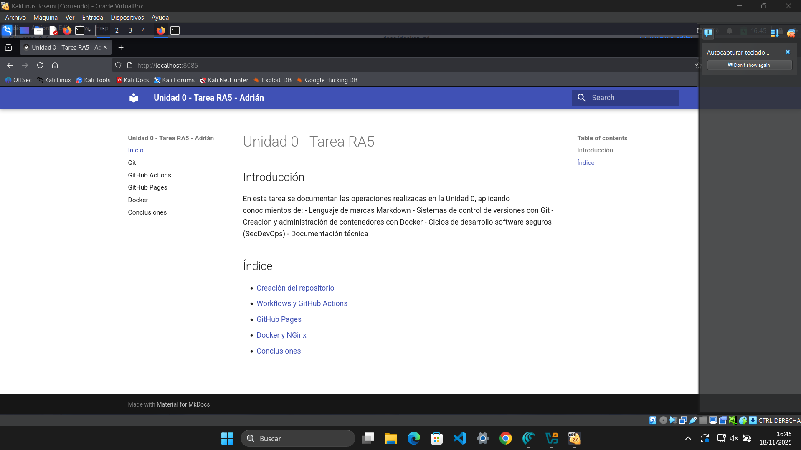

# Contenedor NGINX para servir documentación

## Objetivo
Levantar un contenedor NGINX que sirva la documentación generada por MkDocs desde la rama `gh-pages`.

## Proceso

1. Se cambió a la rama `gh-pages`:
   ```bash
   git checkout gh-pages
   ```

2. Se creó el contenedor:
  ```bash
docker run -d --name PPSUnidad0-Tarea_Adrian -p 8085:80 -v "$(pwd)":/usr/share/nginx/html nginx
  ```


3. Se accedió a la documentación en:
   http://localhost:8085
   



5. Se inspeccionó el contenedor como prueba de su creación (dicho fichero está en el propio repositorio):
  ```bash
 docker inspect PPSUnidad0-Tarea_Adrian > inspect.txt
  ```

